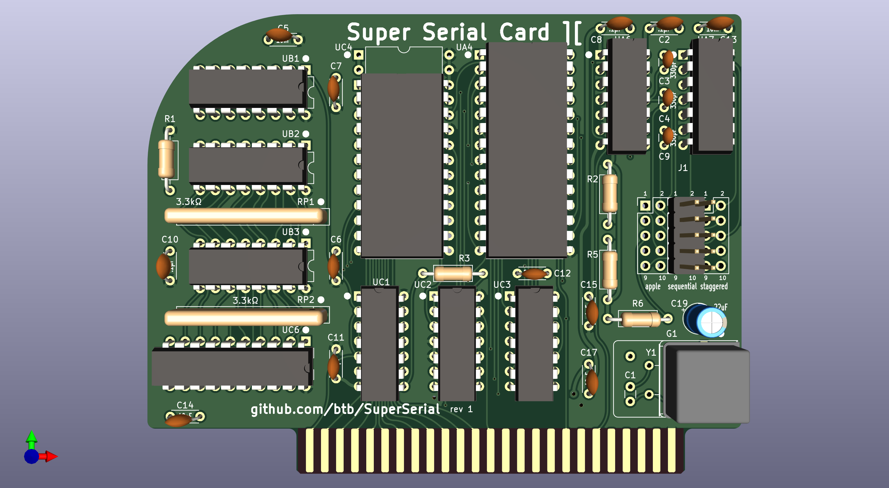
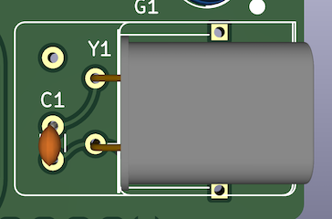
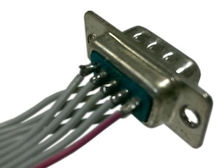
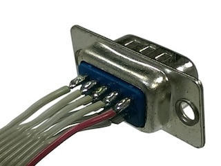
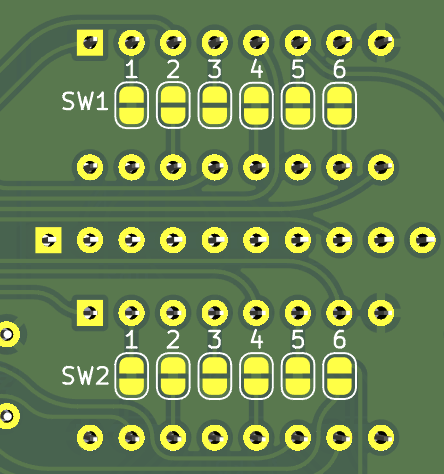

# SuperSerial

A clone of the Apple Super Serial Card ][

[Interactive BOM](https://btb.github.io/SuperSerial/bom/SuperSerial_rev1.html)

## Assembly

### ROM

UC4 is any 2716 or equivalent PROM/EPROM/EEPROM, programmed with the [SSC firmware](https://mirrors.apple2.org.za/Apple%20II%20Documentation%20Project/Interface%20Cards/Serial/Apple%20II%20Super%20Serial%20Card/ROM%20Images/). You can also use a larger/more modern chip such as a 28C256, but note that A11 and A13 will be permanently tied high, and A12 and A14 will be permanently tied low. This means the 2K of firmware code must sit at the 2800h region in the PROM (you can just do what I usually do and fill the entire ROM with repeated copies).

### ACIA

UA4 should be a new old stock MOS 6551 or equivalent. The WDC 65C51 has a well-known bug that likely makes it unsuitable for some uses, though it may be fine for others.

### Oscillator

The original SSC used a 1.8432MHz crystal (Y1) and a usually-omitted 10pF capacitor (C1) for timing the ACIA chip. You can use this same kind of crystal, or you can use a self-contained DIP8 or DIP14 oscillator (G1). If you use a horizontally-mounted crystal at Y1, make sure it is insulated from the unused pads underneath.

Crystal option: 

### Cable Header

You can use a common PC-type IDC10 to DB9M pigtail, or the IDC10 to DB25F pigtail used with the original Apple SSC. There are two different pinouts used in the PC style ("sequential" or "staggered"), and the "apple" pinout is different from both. Only populate the header (J1) for the style you're going to use. "sequential" is the most commonly available type. A keyed/shrouded header is probably best, a right angle/horizontal header would be nice, but you probably only have room for that if you are using the "apple" pinout.

Sequential: 
Staggered: 

### Driver/Receiver

The RS232 Driver/Receiver chips, UA6 and UA7, can be the original MC1488 and MC1489 or equivalents like the 75188 and 75189, or the CMOS equivalents 14C88 and 14C89. If UA6 is a 14C88, you can omit capacitors C3, C4, and C9.

## Configuration

### Modem/Terminal mode

The original SSC used a large DIP16 sized jumper block that could be oriented in two ways for "terminal" or "modem" modes. This card is simply in permanent "modem" mode. If "terminal" mode is required, use a null-modem cable or adapter.

### Configuration jumpers

The original SSC had two sets of 7-position dip switches, for a wide variety of default software settings, this card has no switches, just two sets of 6-position solder jumpers on the rear of the card. These are pre-configured to the use the reasonable modem defaults of:

    SW1: 100111  SW2: 110110

You can cut these traces and re-solder as needed. Note that all of these settings (except for SW2-6) are configurable from software as well. But if you commonly need to use the card for more than one purpose, it's probably best to just have more than one card!

SW1-7 and SW2-7 are omitted since those do not control software defaults, but re-route some signals to non-standard pins. If that's necessary for you, you can use an adapter cable.

## Mounting

Want to make a OEM-style metal bracket to mount your connector to the rear of your Apple II or II+? See my design here: https://github.com/btb/Apple2IOClamps
